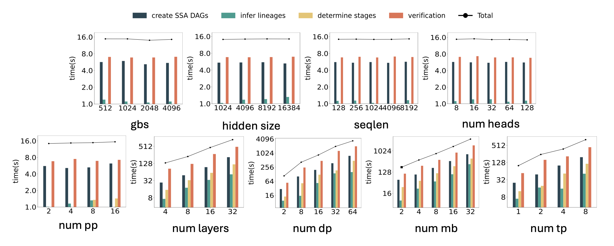
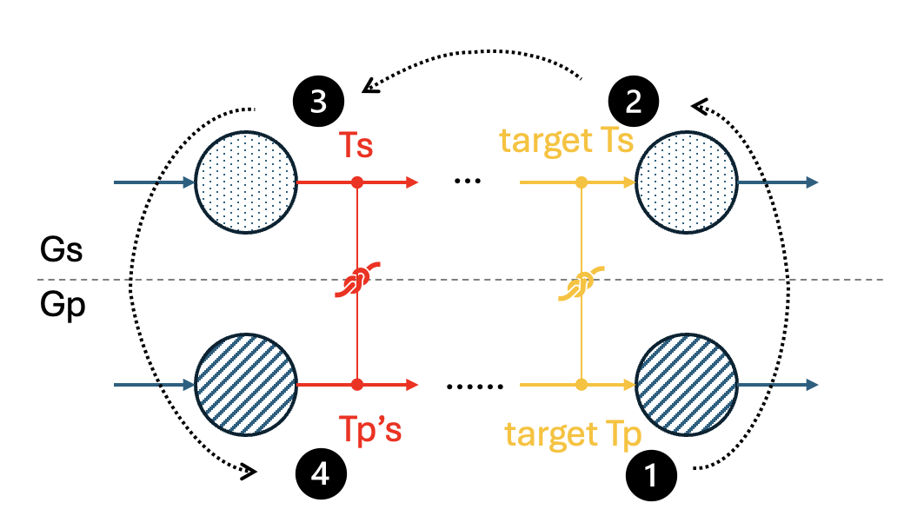

*SOSP'25 Artifact Evaluation for Paper#501 VERDICT*

# Introduction to VERDICT
**Overview:** VERDICT is a verification tool for ensuring *parallelization equivalence* in distributed model training. It guarantees that the parallelized model is arithmetically equivalent to its original single-device version, thereby eliminating errors such as incorrect tensor transformations or faulty collective communication introduced during parallelization.

**Workflow:** 
VERDICT takes the *execution plans* (execplans) of both the original (single-device) and parallelized (multi-device) models, each enriched with *lineages*. It then transforms these into *symbolic SSA DAGs* (single-static assignment directed acyclic graphs). The dual graphs are partitioned into independent *stages* using lineage information. Each stage undergoes parallel execution, where shape reduction is applied, followed by symbolic verification using Z3. If all stages pass, VERDICT guarantees end-to-end equivalence.


**Implementation:** 
VERDICT is implemented with modular interfaces. It defines a general graph interface and a solver interface, supporting a registry of allowable operators. The [*nnScaler*](https://github.com/microsoft/nnscaler) backend constructs SSA DAGs that conform to VERDICT’s requirements. A high-level view of the implementation is shown below:


 

---

# Artifact Evaluation Guide
Welcome to artifact evaluation guide for Verdict (SOSP'25). The following document outlines the procedures needed to reproduce our results and guides you through the key experiments presented in the paper.


### ✅ Checklist with Estimated Time Cost
1. Access hardware resources. (Azure, clone repo)
2. Installation. (conda environment, demo runs) ⏱️ 10 mins
3. Run *Real-world Parallelization* Evaluation (§8.1) ⏱️ 24 hours
4. Run *Scalability* Evaluation (§8.2) ⏱️ 6 hours
5. Run *Bug Reproduction* Evaluation (§8.3) ⏱️ 20 mins

> ⚠️ **Note:** Due to refined design, optimizations and code refactoring, the current evaluation results are improved thus different from statistics in the submitted paper. Please refer to each section for expected outputs. 

### 💻 Hardware Requirements
To fully reproduce results, we recommend to run Verdict artifact evaluation on a machine with at least 32 CPU (virtual) cores and 1TB memory. For SOSP'25 AE reviewers, please contact authors for Azure virtual machine instances.

### 🎭 Recommended Evaluation Strategy
- Evaluation of §8.1 and §8.2 are about Verdict's performance, thus having to be run on capable machines, such as Azure VM instances. These experiments are estimated to take total 30 hours and do not require much reviewer engagement except for inspection of final dumped statistics, due to acknowledged correctness of input models.
- Evaluation of §8.3 bug reproduction can be more interesting. Verdict will verify 14 buggy parallelized models, detect their violations, and print out information helpful for bug diagnosis. These experiments are lightweight, and *can be run on personal devices*.


## 🚀 Installation
1. Create [conda](https://www.anaconda.com/download/success) environment.
    ```
    cd Verdict
    conda env create -f conda-environment.yml
    conda activate verdict
    ```
2. Run demo verification for 2-layer llama3 model parallelization.
    ```
    mkdir data/logs;
    bash scripts/demo_llama3.sh 
    ```
    The `scripts/demo_llama3.sh` essentially runs the following command:
    ```
    python main.py \
        --sm gen_model/mgeners/llama3_default_dp1_pp1_tp1_nm1_gbs32_ly32_h32_hi128_sq8192.pkl \
        --pm gen_model/mgeners/llama3_default_dp2_pp2_tp2_nm2_gbs32_ly32_h32_hi128_sq8192.pkl \
        --seed 0 \
        --time  \
        --max_ser_proc 30 \
        --max_vrf_proc 30 \
        --loglevel INFO \
        --no_cache_nodes \
        --no_cache_stages \
        |& tee -a data/logs/llama3_default_dp2_pp2_tp2_nm2_gbs32_ly32_h32_hi128_sq8192.txt
    ```
    > Command interpretation: `main.py` is the entry of Verdict. `--sm` and `--pm` sepcify the paths of single-device model's and parallelized model's execution plan respectively. `--seed` sets z3 random seed. `--time` activates timer. `--max_ser_proc` and `--max_vrf_proc` set the multiprocessing pool size for building SSA DAGs, and parallel stage execution respectively. `--loglevel` sets logger level. `--no_cache_nodes` and `--no_cache_stages` ignore any cached data and run verification from scratch. `|& tee -a ...` writes logs to a file for inspection convenience.
    
    **👀 Expected Output:** The program should print the following message or similar at the bottom of the output. Indicating successful execution of all stages, as well as the verified end-to-end equivalence.
    ```
    parallel verifying stages: 100%|██████████| 3909/3909 [00:05<00:00, 676.09it/s] 
    PID: ... - ✅ SUCCESS 
    Stats(success=True, ... )
    ```
    > A failed run would print `PID: ... - ❌ FAIL`.
3. Once the demo runs successfully, we can move on to reproduce evaluations.
> ⚠️ **Note:** In all following evaluations, we directly provide execution plans (*.pkl files) of models in stead of building graphs from model code due to time and GPU constraints, as nnScaler parallelizes models through expensive profiling and graph tracing.

## 🚀 Evaluate *Real-World Parallelization*

### 🎯 Goal
(Paper §8.1) To demonstrate Verdict’s practicality and time cost, we experiment on verifying execution plans for LLaMA3 (8B/70B/405B) and DeepSeek-V3 (16B/236B/671B) models under various real-world parallelization setup. There are total 6 runs. Parallelizaion scheme listed below.

### ⏳ Estimated Completion Time
As these plans corresponds to real-world large scale training, involving up to 8192 GPUs, their verification time can be costly. Estimated time is listed below. (L1-L3 and D1-D2 will use 30 workers for stage-parallel execution. D3 will use 10 workers due to memory constraints.)

### 📋 Table of Experiments
| Exp. ID | Model       | DP  | TP  | PP  | NM  | Est. Time |
| ------- | ----------- | --- | --- | --- | --- | --------- |
| L1      | llama3-8B   | 512 | 1   | 1   | 1   | 5 mins    |
| L2      | llama3-70B  | 16  | 8   | 4   | 32  | 2.5 hours |
| L3      | llama3-405B | 64  | 8   | 16  | 16  | 8 hours   |
| D1      | DSV3-16B    | 16  | 4   | 2   | 16  | 30 mins   |
| D2      | DSV3-236B   | 16  | 8   | 4   | 16  | 2.5 hours |
| D3      | DSV3-671B   | 32  | 8   | 8   | 16  | 9 hours   |


### 🛠 How to Run
> ⚠️ Note: As these experiments take hours to run, we recommend using `screen` or `tmux` in case of ssh disconnection.

1. `cd` to working directory (relative path w.r.t repo root): `nnscaler/Verdict`
2. Clean up stale stats.
    ```
    rm data/stats/stats.csv
    ```
3. Run each experiment.
   ```
   bash scripts/run_large_llama3_8B.sh;
   bash scripts/run_large_llama3_70B.sh;
   bash scripts/run_large_llama3_405B.sh;
   bash scripts/run_large_moe_16B.sh;
   bash scripts/run_large_moe_236B.sh;
   bash scripts/run_large_moe_671B.sh;
   ```
    Each script contains a command similar to the demo's in installation guide. Feel free to take a look.


### 👀 Expected Output

Each experiment is expected to print the following message or similar at the end of their respective log, indicating success of verification. The `Stats` will contain the time of execution, which will also be dumped to `data/stats/stats.csv`.
```
PID: ... - ✅ SUCCESS 
Stats(success=True, ... )
```
To check the evaluation results conveniently, take a look at the column `t_total` in `data/stats/stats.csv` and compare with either estimated time in the Table of Experiments above, or our updated evaluation results (to be appear in camera-ready) in `data/4_stats_large_final.csv`. The measured time should be close. Compared with Table 3 in paper §8.1, the improved verification time takes only the half.

## 🚀 Evaluate *Scalability*

### 🎯 Goal
(Paper §8.2) This evaluation measures scalability trends of Verdict. According to the design of Verdict, the time complexity should be invariant with respect to actual tensor shapes due to shape reduction, and sub-/linear to parallelization.

### ⏳ Estimated Completion Time
There will be 40 runs, taking 6 hours in total.

### 🛠 How to Run
> ⚠️ Note: As these experiments take hours to run, we recommend using `screen` or `tmux` in case of ssh disconnection.

1. `cd` to working directory (relative path w.r.t repo root): `nnscaler/Verdict`
2. Clean up stale stats. 
    ```
    rm data/stats/stats.csv
    ```
    > ⚠️ Important. As we will later make plot graph based on this file, requiring the csv only contains results from this evaluation.
3. Run experiments.
   ```
   bash scripts/run_trends_full_8B.sh
   ```
4. Plot time complexity trends.
   ```
   cd ../ae;
   python draw.py
   ```
### 👀 Expected Output
Inspect output plots in `nnscaler/ae/figs`. The trends should ressemble the following plots. The complexity trends are also expected to be consistent with Figure 6 in paper §8.2, though the breakdown time components and absolute time may differ.



## 🚀 Evaluate *Bug Reproduction*

### 🎯 Goal
(Paper §8.3) This evaluation demonstrates Verdict can detect real-world parallelization bugs. We will use Verdict to verify 14 buggy execution plans crafted from real-world buggy models. We will see how Verdict detect them, and output useful information for diagnosis. All execution plans are crafted on the base model of llama3-8B with 2-way DP, 2-way TP, 2-way PP and 2 microbatches.

### ⏳ Estimated Completion Time
Total execution time of 14 cases should finish within 3 minumtes. Manual examination of results takes around 15 minutes.

### 📋 Table of Bugs
| Bug ID | Type            | Description                                                         |
| ------ | --------------- | ------------------------------------------------------------------- |
| 1      | communication   | Missing `allreduce` operation without breaking dataflow             |
| 2      | communication   | Missing `allreduce` operation with broken dataflow                  |
| 3      | communication   | `allreduce` primitive replaced by `allgather`                       |
| 4      | communication   | `allgather` primitive replaced by `allreduce`                       |
| 5      | communication   | Missing reduce operation in backward fused operator                 |
| 6      | rank assignment | Wrong rank assignment of tensor movement between pipeline stages    |
| 7      | computation     | Single-rank mutant on fw ADD op, adding inconsistent constants      |
| 8      | computation     | Single-rank mutant on fw POW op, powering inconsistent constants    |
| 9      | computation     | Multi-rank mutant on fw ADD op, adding inconsistent constants       |
| 10     | computation     | Single-rank mutant on bw MULTIREF op, consuming wrong input tensors |
| 11     | computation     | Single-rank mutant on bw APPLY_ROTARY_EMB, reversing output tensors |
| 12     | scaling         | Inconsistent scaling of tensors                                     |
| 13     | scaling         | Inconsistent scaling of tensors                                     |
| 14     | scheduling      | Lauching reducer before the last operator of the second microbatch  |


### 🛠 How to Run
1. `cd` to working directory (relative path w.r.t repo root): `nnscaler/Verdict`
2. Run experiments. Also log outputs to `nnscaler/ae/br*.log` for examination convenience.
   ```
   bash scripts/run_br.sh
   ```

### 👀 Expected Output
Inspect `nnscaler/ae/br[bug_id].log`. The following document guides you how to interpret the error logs case by case. We use `Gs` and `Gp` to refer to single-device graph and multi-device graph; `Ts` and `Tp` for their tensors.

#### 🔖 Bug 1
The log should contain the following lines.
```
❌ ERROR: 🚨 Stage 53 solver result: sat

Node(wtype='p', rank=4, mb=1, cid=5991, irname='IdentityAllreducePrim')
...

🔗 OUTPUT LINEAGES
👉 Tensor(wtype='s', rank=0, mb=0, tid=7000, v=1)
    [[[-2.]]
    [[ 0.]]
    [[ 0.]]
    [[ 0.]]]
🍕 ((0, 8), (0, 8192), (0, 128)) [[[-2.]]]
    =  ⨁ Tensor(wtype='p', rank=0, mb=0, tid=7000, v=1) [[[-1.]]]
    🚨 ⬆️
    =  ⨁ Tensor(wtype='p', rank=1, mb=0, tid=7000, v=1) [[[-1.]]]
    🚨 ⬆️
🍕 ((8, 16), (0, 8192), (0, 128)) [[[0.]]]
...

RuntimeError: Stage 53 equivalence fails.
...
```
The log indicates that it is satisfiable to find a solution of non-equivalence between Gs and Gp at stage 53, followed by verbose nodes list `Node(wtype='p', ...)` in this stage. 

It then provide concrete values for the lineaged tensors. For this example, it shows the output tensor Ts `👉 Tensor(wtype='s', rank=0, mb=0, tid=7000, v=1)` is detected inconsistent with its Tp's. Its subtensor sliced by slc:`🍕 ((0, 8), (0, 8192), (0, 128))` (reprensented in full shape) has value `[[[-2.]]]`, and as specified by lineage, is expected to be equal to both Tp1: `Tensor(wtype='p', rank=0, mb=0, tid=7000, v=1)` and Tp2: `Tensor(wtype='p', rank=1, mb=0, tid=7000, v=1)`; however, both Tp1 and Tp2 have value `[[[-1.]]]`.

Recall that Bug 1 is missing an allreduce operator, which aligns with the concrete values. The output lineage expects Ts[slc] == Tp1 == Tp2 (the state after allreduce), yet the buggy model produces Ts[slc] == Tp1 + Tp2 (the state before allreduce). 

#### 🔖 Bug 2
The log should contain the following lines.
```
❌ ERROR: Target Tp is not reachable from any source Tp bound to Ts's lineage. 
target_Tp: Tensor(wtype='p', rank=0, mb=0, tid=7000, v=0),
Ts: Tensor(wtype='s', rank=0, mb=0, tid=7000, v=1),
...
```
The log indicates a runtime error occured when breaking down the full Gs and Gp into stages. The target Tp `Tensor(wtype='p', rank=0, mb=0, tid=7000, v=0)` is serving as an output tensor of the new stage (refer to the following illustration). A stage is ideally determined by finding Ts and Tp's (which are tensors in already verified lineages), and extract  the nodes between Tp's and target Tp (as well as nodes between Ts and target Ts). Verdict will sanity check that target Tp is reachable from *any* of tensor in candidate Tp's. The error log shows that this reachability is not met, and graph slicing is aborted.


Recall that in Bug 2, the missing operator breaks the dataflow. Such bugs are early detected before executing symbolic verification.

#### 🔖 Bug 3
The log should contain the following lines.
```
❌ ERROR: Tensor shape mismatch. 
Expect: [np.int64(1), np.int64(1), np.int64(1)], Result: [2, 1, 1], 
Node: Node(wtype='p', rank=0, mb=0, cid=5991, irname='AllGatherPrim')
``` 
The log shows that the output tensor of the node should have shape `[1,1,1]`, but we get `[2,1,1]`.

Recall that the cause of Bug 3 is `allreduce` replaced by `allgather`, causing a shape mismatch.

#### 🔖 Bug 4
The log should contain the following lines.
```
❌ ERROR: Stage worker raised an exception. Stage: 871, ...
File "/mnt/nnscaler/Verdict/verdict/stage/rxshape.py", line 102, in minimize
    assert sat == z3.sat, sat
AssertionError: unsat
``` 
The assertion error is raise by the process of shape reduction of stage 871. The solver reports the shape optimization problem is unsatisfiable.

Recall that the cause of Bug 4 is `allgather` replaced by `allreduce`, the output shape inconsistency is reflected by the solver.

#### 🔖 Bug 5
The log should contain the following lines.
```
❌ ERROR: 🚨 Stage 987 solver result: sat

Node(wtype='s', rank=0, mb=0, cid=3167, irname='multiref')
...
Node(wtype='p', rank=6, mb=1, cid=12736, irname='AllReduceIdentityPrim')
...
Node(wtype='p', rank=6, mb=1, cid=1, irname='local_grad_accumulation')
...
Node(wtype='p', rank=6, mb=1, cid=11700, irname='multiref')
...

🔗 OUTPUT LINEAGES
👉 Tensor(wtype='s', rank=0, mb=0, tid=12441, v=1)
    [[[2.]]
    [[3.]]
    [[4.]]
    [[5.]]]
🍕 ((0, 8), (0, 8192), (0, 128)) [[[2.]]]
    =  ⨁ Tensor(wtype='p', rank=2, mb=0, tid=18484, v=1) [[[6.]]]
    🚨 ⬆️
    =  ⨁ Tensor(wtype='p', rank=3, mb=0, tid=18496, v=1) [[[6.]]]
    🚨 ⬆️
...

👉 Tensor(wtype='s', rank=0, mb=0, tid=12445, v=1)
    [[[2.]]
    [[3.]]
    [[4.]]
    [[5.]]]
🍕 ((0, 8), (0, 8192), (0, 128)) [[[2.]]]
    =  ⨁ Tensor(wtype='p', rank=2, mb=0, tid=18488, v=1) [[[6.]]]
    🚨 ⬆️
    =  ⨁ Tensor(wtype='p', rank=3, mb=0, tid=18500, v=1) [[[6.]]]
    🚨 ⬆️
...

RuntimeError: Stage 987 equivalence fails.
...
``` 
The way of interpretation is similar to Bug 1.

Recall that Bug 5 is caused by the fused communication operator in the backward pass misses an `allreduce` operation, being replaced by `identity` operation. As this stage involves multiple injected nodes (bw multiref, AllreduceIdentityPrim, and gradient accumulation across microbatches), the root cause (missing `allreduce`) cannot be easily eyeballed from concrete values, and requires manual diagnosis.

#### 🔖 Bug 6
The log should contain the following lines.
```
❌ ERROR: Target Tp is not reachable from any source Tp bound to Ts's lineage.
target_Tp: Tensor(wtype='p', rank=2, mb=0, tid=10953, v=1),
Ts: Tensor(wtype='s', rank=0, mb=0, tid=7841, v=1),
...
``` 
The way of interpretation is similar to Bug 2.

The cause of Bug 6 is the wrong assignment of MovePrim's src and dst ranks, which moves tensors across GPUs belonging to different pipeline parallelism stages. The bug causes broken dependency between predecessor and successor lineages.

#### 🔖 Bug 7
The log should contain the following lines.
```
❌ ERROR: 🚨 Stage 8 solver result: sat

Node(wtype='s', rank=0, mb=0, cid=6, irname='add')
...

🔗 OUTPUT LINEAGES
👉 Tensor(wtype='s', rank=0, mb=0, tid=6949, v=1)
    [[[2.00001]]
    [[3.00001]]
    [[4.00001]]
    [[5.00001]]]
🍕 ((0, 8), (0, 8192), (0, 1)) [[[2.00001]]]
    =  ⨁ Tensor(wtype='p', rank=0, mb=0, tid=6949, v=1) [[[4.]]]
    🚨 ⬆️
    =  ⨁ Tensor(wtype='p', rank=1, mb=0, tid=6949, v=1) [[[2.00001]]]
🍕 ((8, 16), (0, 8192), (0, 1)) [[[3.00001]]]
    =  ⨁ Tensor(wtype='p', rank=0, mb=1, tid=6949, v=1) [[[5.]]]
    🚨 ⬆️
    =  ⨁ Tensor(wtype='p', rank=1, mb=1, tid=6949, v=1) [[[3.00001]]]
...

RuntimeError: Stage 8 equivalence fails.
...
``` 
The log shows that the `add` operator on rank 0 produces inconsistent results. For example, flagged by `🚨`, the Tp with tid=6949 from microbatche mb=0 has concrete value `[[[4.]]]`, while `[[[2.00001]]]` is expected. The bug is cause by the rank 0 `add` operator being mutated on its constant epsilon.

#### 🔖 Bug 8
The log should contain the following lines.
```
❌ ERROR: 🚨 Stage 40 solver result: sat

Node(wtype='s', rank=0, mb=0, cid=36, irname='pow')
...

🔗 OUTPUT LINEAGES
👉 Tensor(wtype='s', rank=0, mb=0, tid=6985, v=1)
    [[[ 1.]]
    [[ 9.]]
    [[16.]]
    [[25.]]]
🍕 ((0, 8), (0, 8192), (0, 128)) [[[1.]]]
    =  ⨁ Tensor(wtype='p', rank=0, mb=0, tid=6985, v=1) [[[-1.]]]
    🚨 ⬆️
    =  ⨁ Tensor(wtype='p', rank=1, mb=0, tid=6985, v=1) [[[1.]]]
🍕 ((8, 16), (0, 8192), (0, 128)) [[[9.]]]
    =  ⨁ Tensor(wtype='p', rank=0, mb=1, tid=6985, v=1) [[[3.]]]
    🚨 ⬆️
    =  ⨁ Tensor(wtype='p', rank=1, mb=1, tid=6985, v=1) [[[9.]]]
...

RuntimeError: Stage 40 equivalence fails.
...
``` 
The interpretation and root cause is similar to Bug 7, except for the rank 0 `pow` operator is mutated, with `pow(x,2)` modified as `pow(x,1)`.

#### 🔖 Bug 9
The log should contain the following lines.
```
❌ ERROR: 🚨 Stage 840 solver result: sat

Node(wtype='s', rank=0, mb=0, cid=742, irname='add')
...

👉 Tensor(wtype='s', rank=0, mb=0, tid=7845, v=1)
    [[[2.00001]]
    [[3.00001]]
    [[4.00001]]
    [[5.00001]]]
🍕 ((0, 8), (0, 8192), (0, 1)) [[[2.00001]]]
    =  ⨁ Tensor(wtype='p', rank=0, mb=0, tid=7845, v=1) [[[4.]]]
    🚨 ⬆️
    =  ⨁ Tensor(wtype='p', rank=1, mb=0, tid=7845, v=1) [[[4.]]]
    🚨 ⬆️
🍕 ((8, 16), (0, 8192), (0, 1)) [[[3.00001]]]
    =  ⨁ Tensor(wtype='p', rank=0, mb=1, tid=7845, v=1) [[[5.]]]
    🚨 ⬆️
    =  ⨁ Tensor(wtype='p', rank=1, mb=1, tid=7845, v=1) [[[5.]]]
    🚨 ⬆️
...

RuntimeError: Stage 840 equivalence fails.
...
``` 
The interpretation and root cause is similar to Bug 7, yet multiple ranks are mutated. Compared with Bug 7 where only rank 0's output tensors are flagged by `🚨`, Bug 9 flags both rank 0's and rank 1's outputs as inconsistent.

#### 🔖 Bug 10
The log should contain the following lines.
```
❌ ERROR: 🚨 Stage 2499 solver result: sat

Node(wtype='s', rank=0, mb=0, cid=3138, irname='BW.multiref')
...

🔗 OUTPUT LINEAGES
👉 Tensor(wtype='s', rank=0, mb=0, tid=9855, v=1)
    [[[18.]]
    [[21.]]
    [[24.]]
    [[27.]]]
🍕 ((0, 8), (0, 8192), (0, 128)) [[[18.]]]
    =  ⨁ Tensor(wtype='p', rank=2, mb=0, tid=9855, v=1) [[[28.]]]
    🚨 ⬆️
    =  ⨁ Tensor(wtype='p', rank=3, mb=0, tid=9855, v=1) [[[18.]]]
...

RuntimeError: Stage 2499 equivalence fails.
...
``` 
The backward propagation of the `multiref` operator consumes wrong gradients as input, causing wrong output gradient.

#### 🔖 Bug 11
The log should contain the following lines.
```
❌ ERROR: Target Tp is not reachable from any source Tp bound to Ts's lineage.
target_Tp: Tensor(wtype='p', rank=2, mb=0, tid=9869, v=1),
Ts: Tensor(wtype='s', rank=0, mb=0, tid=9868, v=1),
...
``` 
The backward propagation of `apply_rotary_emb` produces two gradient tensors as outputs. However, they are mistakenly exchanged. The later stage that consumes these tensors as inputs detects the broken dependency and throws the error.

#### 🔖 Bug 12
The log should contain the following lines.
```
❌ ERROR: 🚨 Stage 130 solver result: sat

Node(wtype='s', rank=0, mb=0, cid=116, irname='div')
...

🔗 OUTPUT LINEAGES
👉 Tensor(wtype='s', rank=0, mb=0, tid=7084, v=1)
    [[[[1. ]]]
    [[[1.5]]]
    [[[2. ]]]
    [[[2.5]]]]
🍕 ((0, 8), (0, 32), (0, 8192), (0, 8192)) [[[[1.]]]]
    =  ⨁ Tensor(wtype='p', rank=0, mb=0, tid=7084, v=1) [[[[0.5]]]]
    🚨 ⬆️
    =  ⨁ Tensor(wtype='p', rank=1, mb=0, tid=7084, v=1) [[[[1.]]]]
🍕 ((8, 16), (0, 32), (0, 8192), (0, 8192)) [[[[1.5]]]]
...

RuntimeError: Stage 130 equivalence fails.
...
``` 
The log indicates inconsistent scaling of tensors on rank 0.

#### 🔖 Bug 13
The log should contain the following lines.
```
❌ ERROR: 🚨 Stage 130 solver result: sat

Node(wtype='s', rank=0, mb=0, cid=116, irname='div')
...

🔗 OUTPUT LINEAGES

👉 Tensor(wtype='s', rank=0, mb=0, tid=7084, v=1)
    [[[[1. ]]]
    [[[1.5]]]
    [[[2. ]]]
    [[[2.5]]]]
🍕 ((0, 8), (0, 32), (0, 8192), (0, 8192)) [[[[1.]]]]
    =  ⨁ Tensor(wtype='p', rank=0, mb=0, tid=7084, v=1) [[[[0.5]]]]
    🚨 ⬆️
    =  ⨁ Tensor(wtype='p', rank=1, mb=0, tid=7084, v=1) [[[[0.5]]]]
    🚨 ⬆️
🍕 ((8, 16), (0, 32), (0, 8192), (0, 8192)) [[[[1.5]]]]
...

RuntimeError: Stage 130 equivalence fails.
...
``` 
The log indicates inconsistent scaling of tensors on both rank 0 and rank 1.

#### 🔖 Bug 14
The log should contain the following lines.
```
❌ ERROR: (0, 0, 0, 1, False) traceback: ...
  File "/mnt/nnscaler/Verdict/nnscaler_backend/build_lineage.py", line 79, in _reorganize_Gp_nodes
    target.extend(indexed_nodes[(dp, tp, pp, mb, False)])
KeyError: (0, 0, 0, 1, False)
``` 
Bug 14 issues cross-dp gradient synchronization before the second microbatch completes all its operations, leaving alone the last backward operator. The log indicates that symmetry among microbatches is violated, and Verdict is unable to align and infer lineages. 