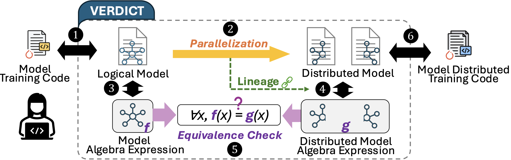
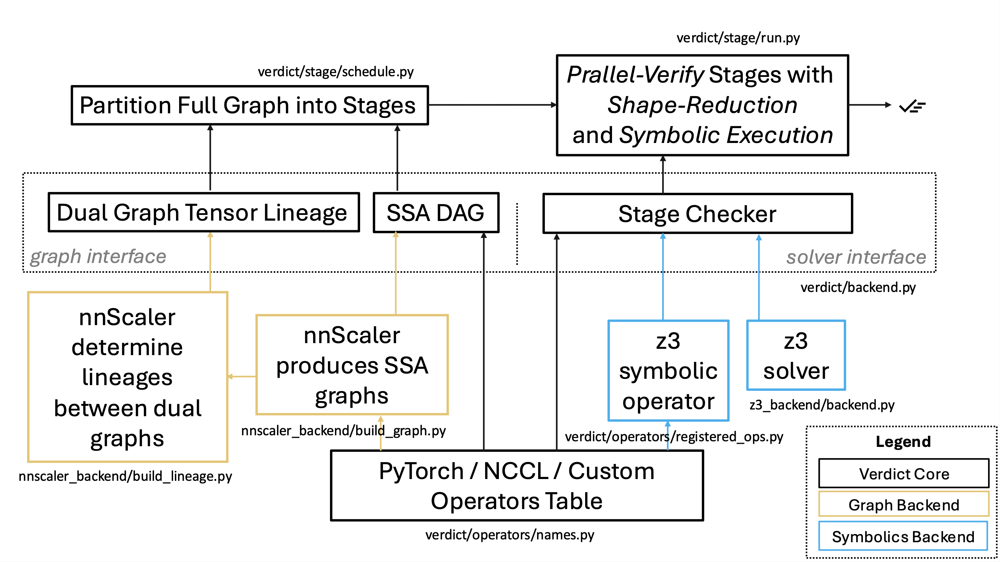

*SOSP'25 Artifact Evaluation for VERDICT*

# Introduction to Verdict
**Overview:**
**Verdict** is a tool to verify parallelization equivalence for distributed model training. It ensures that the original and parallelized models are arithmetically equivalent, effectively eliminating bugs such as wrong tensor transformation, wrong collective communications, etc., that are introduced in the parallelization process.

**Workflow:**
Verdict takes the *execution plans* of both single-device (original) model and multi-device (parallelized) model as inputs enriched with *lineages*, and converts respective execplan into *symbolic SSA DAG* (single-static assignment directed acyclic graph). Verdict then partition dual graphs into small subgraphs to form independent *stages* based on lineages. Once stages are determined, they are executed in parallel. Within each stage, tensor shape reduction is applied, and z3 is used to symbolically verify the output equivalence. Once all stage passes the check, the end-to-end equivalence is guaranteed.


**Implementation:** 
Verdict is implemented with an interface design. Verdict defines a general graph interface and a solver interface, with a list of allowable reigistered operators. The nnScaler backend takes the responsibility to produce SSA DAGs that meet the requirements. A coarse reference to source code is shown in below.


# Artifact Evaluation Guide
Welcome to artifact evaluation guide for Verdict (SOSP'25). The following document outlines the procedures needed to reproduce our results and guides you through the key experiments presented in the paper.


### ✅ Checklist with Estimated Time Cost
1. Access hardware resources. (Azure, clone repo)
2. Installation. (conda environment, demo runs)
⏱️ 10 mins
3. Run *Real-world Parallelization* Evaluation (§8.1)
⏱️ 24 hours
4. Run *Scalability* Evaluation (§8.2)
⏱️ 6 hours
5. Run *Bug Reproduction* Evaluation (§8.3)
⏱️ 20 mins

> ⚠️ **Note:** Due to refined design, optimizations and code refactoring, the current evaluation results are improved thus different from statistics in the submitted paper. Please refer to each section for expected outputs. 

### 💻 Hardware Requirements
To fully reproduce results, we recommend to run Verdict artifact evaluation on machines with at least 32 CPU (virtual) cores and 1TB memory. For SOSP'25 AE reviewers, please contact authors for Azure virtual machine instances.

### 🎭 Recommended Evaluation Strategy
- Evaluation of §8.1 and §8.2 are about Verdict's performance, thus having to be run on capable machines, such as Azure VM instances. These experiments are estimated to take total 30 hours and do not require much reviewer engagement except for inspection of final dumped statistics, due to acknowledged correctness of input models.
- Evaluation of §8.3 bug reproduction can be more interesting. Verdict will verify 14 buggy parallelized models, detect their violations, and print out information helpful for bug diagnosis. These experiments are lightweight, and *can be run on personal devices*.


## 🚀 Installation
1. Create conda environment.
    ```
    cd Verdict
    conda env create -f conda-environment.yml
    conda activate verdict
    ```
2. Run demo verification for 2-layer llama3 model parallelization.
    ```
    bash scripts/demo_llama3.sh 
    ```
    The `scripts/demo_llama3.sh` essentially runs the following command:
    ```
    python main.py \
        --sm gen_model/mgeners/llama3_default_dp1_pp1_tp1_nm1_gbs32_ly32_h32_hi128_sq8192.pkl \
        --pm gen_model/mgeners/llama3_default_dp2_pp2_tp2_nm2_gbs32_ly32_h32_hi128_sq8192.pkl \
        --seed 0 \
        --time  \
        --max_ser_proc 30 \
        --max_vrf_proc 30 \
        --loglevel INFO \
        --no_cache_nodes \
        --no_cache_stages \
        |& tee -a data/logs/llama3_default_dp2_pp2_tp2_nm2_gbs32_ly32_h32_hi128_sq8192.txt
    ```
    > Command interpretation: `main.py` is the entry of Verdict. `--sm` and `--pm` sepcify the paths of single-device model's and parallelized model's execution plan respectively. `--seed` sets z3 random seed. `--time` activates timer. `--max_ser_proc` and `--max_vrf_proc` set the multiprocessing pool size for building SSA DAGs, and parallel stage execution respectively. `--loglevel` sets logger level. `--no_cache_nodes` and `--no_cache_stages` ignore any cached data and run verification from scratch. `|& tee -a ...` writes logs to a file for inspection convenience.
    
    **👀 Expected Output:** The program should print the following message or similar at the bottom of the output. Indicating successful execution of all stages, as well as the verified end-to-end equivalence.
    ```
    parallel verifying stages: 100%|██████████| 3909/3909 [00:05<00:00, 676.09it/s] 
    PID: ... - ✅ SUCCESS 
    Stats(success=True, ... )
    ```
    > A failed run would print `PID: ... - ❌ FAIL`.
3. Once the demo runs successfully, we can move on to reproduce evaluations.

## 🚀 Evaluate *Real-World Parallelization*

### 🎯 Goal
(Paper §8.1) To demonstrate Verdict’s practicality and time cost, we experiment on verifying execution plans for LLaMA3 (8B/70B/405B) and DeepSeek-V3 (16B/236B/671B) models under various real-world parallelization setup. There are total 6 runs. Parallelizaion scheme listed below.

### ⏳ Estimated Completion Time
As these plans corresponds to real-world large scale training, involving up to 8192 GPUs, their verification time can be costly. Estimated time is listed below. (L1-L3 and D1-D2 will use 30 workers for stage-parallel execution. D3 will use 10 workers due to memory constraints.)

### 📋 Table of Experiments
| Exp. ID | Model       | DP  | TP  | PP  | NM  | Est. Time |
| ------- | ----------- | --- | --- | --- | --- | --------- |
| L1      | llama3-8B   | 512 | 1   | 1   | 1   | 5 mins    |
| L2      | llama3-70B  | 16  | 8   | 4   | 32  | 2.5 hours |
| L3      | llama3-405B | 64  | 8   | 16  | 16  | 8 hours   |
| D1      | DSV3-16B    | 16  | 4   | 2   | 16  | 30 mins   |
| D2      | DSV3-236B   | 16  | 8   | 4   | 16  | 2.5 hours |
| D3      | DSV3-671B   | 32  | 8   | 8   | 16  | 9 hours   |


### 🛠 How to Run
> ⚠️ Note: As these experiments take hours to run, we recommend using `screen` or `tmux` in case of ssh disconnection.

1. `cd` to working directory (relative path): `nnscaler/Verdict`
2. Clean up stale stats.
    ```
    rm data/stats/stats.csv
    ```
3. Run each experiment.
   ```
   bash scripts/run_large_llama3_8B.sh;
   bash scripts/run_large_llama3_70B.sh;
   bash scripts/run_large_llama3_405B.sh;
   bash scripts/run_large_moe_16B.sh;
   bash scripts/run_large_moe_236B.sh;
   bash scripts/run_large_moe_671B.sh;
   ```
    Each script contains a command similar to the demo's in installation guide. Feel free to take a look.

### 👀 Expected Output

Each experiment is expected to print the following message or similar at the end of their respective log, indicating success of verification. The `Stats` will contain the time of execution, which will also be dumped to `data/stats/stats.csv`.
```
PID: ... - ✅ SUCCESS 
Stats(success=True, ... )
```
To check the evaluation results conveniently, take a look at the column `t_total` in `data/stats/stats.csv` and compare with either estimated time in the Table of Experiments above, or our updated evaluation results (to be appear in camera-ready) in `data/4_stats_large_final.csv`. The measured time should be close.

## 🚀 Evaluate *Scalability*

### 🎯 Goal
(Paper §8.1) This evaluation measures scalability trends of Verdict. According to the design of Verdict, the time complexity should be invariant with respect to actual tensor shapes due to shape reduction, and sub-/linear to parallelization.

### ⏳ Estimated Completion Time
There will be 40 runs, taking 6 hours in total.

### 🛠 How to Run
> ⚠️ Note: As these experiments take hours to run, we recommend using `screen` or `tmux` in case of ssh disconnection.

1. `cd` to working directory (relative path): `nnscaler/Verdict`
2. Clean up stale stats. 
    ```
    rm data/stats/stats.csv
    ```
    > ⚠️ Important. As we will later make plot graph based on this file, requiring the csv only contains results from this evaluation.
3. Run experiments.
   ```
   bash scripts/run_trends_full_8B.sh
   ```
4. Plot time complexity trends.
   ```
   cd ../ae;
   python draw.py
   ```
### 👀 Expected Output


## 🚀 Evaluate *Bug Reproduction*

### 🎯 Goal

### ⏳ Estimated Completion Time

### 🛠 How to Run

### 👀 Expected Output