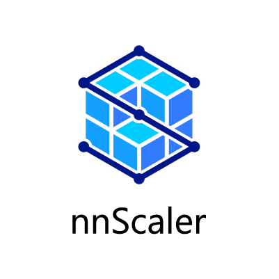
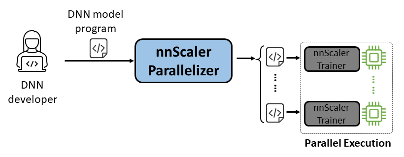

  

nnScaler: Compiling DNN models for Parallel Training over Multiple Devices
==============


# What is nnScaler?

---------
nnScaler is a parallelization engine that compiles a Deep neural network (DNN) model that designed for single-GPU execution into a program that capable of running in parallel across multiple GPUs.



# Latest News
nnScaler (also known as CUBE as code name) has been adopted by multiple product and research projects, this section includes some of the latest news from the team and partner projects.
* **2024-11-26** nnScaler 0.5 released: https://github.com/microsoft/nnscaler/releases/tag/0.5
* **2024-10-07** Diff-Transformer utilizes nnScaler for differential attention mechanism: [DIFFERENTIAL TRANSFORMER](https://arxiv.org/abs/2410.05258)
* **2024-05-09** YOCO utilizes nnScaler for long-sequence training: [(YOCO)You only cache once: Decoder-decoder architectures for language models](https://arxiv.org/abs/2405.05254)
* **2024-04-22** Post training for the long context version of [Phi-3 series](https://arxiv.org/abs/2404.14219)
* **2024-02-21** LongRoPE utilizes nnScaler to reduce both the training and inference costs: [LongRoPE: Extending LLM context window beyond 2 million tokens](https://arxiv.org/abs/2402.13753)

### System Highlights:

* Ease of Use: Only a few lines of code need to be changed to enable automated parallelization.
* Pythonic: The parallelization output is in PyTorch code, making it easy for users to understand and convenient for further development or customization.
* Extensibility: nnScaler exposes an API to support new operators for emerging models.
* Reliability: Verified through various end-to-end training sessions, nnScaler is a dependable system.
* Performance: By exploring a large parallelization space, nnScaler can significantly enhance parallel training performance.

For **_DNN scientists_**, they can concentrate on model design with PyTorch on single GPU, while leaving parallelization complexities to nnScaler. It introduces innovative parallelism techniques that surpass existing methods in performance. Additionally, nnScaler supports the extension of DNN modules with new structures or execution patterns, enabling users to parallelize their custom DNN models.

For **_DNN system experts_**, they can leverage nnScaler to explore new DNN parallelization mechanisms and policies for emerging models. By providing user-defined functions for new operators not recognized by nnScaler, it ensures seamless parallelization of novel DNN models. For example, to facilitate long sequence support in LLMs.


# Quick start

---------

## Installation

### Prerequisite

Install the following packages before the installation of nnScaler:

    Python >= 3.9, < 3.11 (3.10 is recommanded)

    PyTorch >= 2.0, < 2.4 (2.2.0 is recommanded)

### Install nnScaler from source
Execute below commands in nnScaler directory: 

    pip install -r requirements.txt
    pip install -e .

Besides, to avoid *cppimport* error, it also needs to include nnScaler directory in environment variable **PYTHONPATH**:

    export NNSCALER_HOME=$(pwd)
    export PYTHONPATH=${NNSCALER_HOME}:$PYTHONPATH

[//]: # (Reference output: Successfully installed MarkupSafe-2.1.5 contourpy-1.3.0 cppimport-22.8.2 cycler-0.12.1 dill-0.3.8 filelock-3.15.4 fonttools-4.53.1 fsspec-2024.6.1 importlib-resources-6.4.4 jinja2-3.1.4 kiwisolver-1.4.5 mako-1.3.5 matplotlib-3.9.2 more-itertools-10.4.0 mpmath-1.3.0 networkx-3.3 numpy-2.1.0 nvidia-cublas-cu12-12.1.3.1 nvidia-cuda-cupti-cu12-12.1.105 nvidia-cuda-nvrtc-cu12-12.1.105 nvidia-cuda-runtime-cu12-12.1.105 nvidia-cudnn-cu12-9.1.0.70 nvidia-cufft-cu12-11.0.2.54 nvidia-curand-cu12-10.3.2.106 nvidia-cusolver-cu12-11.4.5.107 nvidia-cusparse-cu12-12.1.0.106 nvidia-nccl-cu12-2.20.5 nvidia-nvjitlink-cu12-12.6.68 nvidia-nvtx-cu12-12.1.105 packaging-24.1 pillow-10.4.0 psutil-6.0.0 pulp-2.9.0 pybind11-2.13.5 pyparsing-3.1.4 python-dateutil-2.9.0.post0 pyyaml-6.0.2 six-1.16.0 sympy-1.13.2 torch-2.4.0 tqdm-4.66.5 triton-3.0.0 typing-extensions-4.12.2)


## Example Llama-3

### Prerequisite for Llama-3

Install packages required to run Llama-3. Besides, a certain version of CUDA library is needed during flash-attn installation. For example, [CUDA V11.8](https://developer.nvidia.com/cuda-11-8-0-download-archive) is needed if using PyTorch 2.20. 

    python -m pip install transformers==4.40.0 flash-attn==2.5.5 tensorboard

### Model Access

Obtain access of Llama-3 model from [HuggingFace](https://huggingface.co/meta-llama/Meta-Llama-3-8B-Instruct), where you will receive an access token which should be set as an environment variable: 

    export HF_TOKEN=<HUGGINGFACE_ACCESS_TOKEN>

### Code Changes for Parallelization

You can find all the example code at `examples/llama`. As shown below, a user needs to:
* Wrap the Model: Include loss computation and other necessary components.
* Configure Components: Set up the model, optimizer, and dataloader.
* Initialize and Start: In the main function, create an nnScaler trainer with the above configurations and start the training process.

```python
# import the nnScaler build-in parallelization-capable trainer
from nnscaler.cli.trainer import Trainer

# wrap model to include loss computing, etc.
class WrapperModel(torch.nn.Module):
    def __init__(self, model_id):
        super().__init__()
        self.model = AutoModelForCausalLM.from_pretrained(model_id, attn_implementation='flash_attention_2')

    def forward(self, samples):
        outputs = self.model.model(
            input_ids=samples['net_input']['src_tokens'],
            use_cache=False,
            return_dict=False,
        )
        loss = torch.sum(chunk_linear_cross_entropy(outputs[0], self.model.lm_head.weight, samples['target'], ...))
        return loss, samples['ntokens'], samples['nsentences']

def main(args):
    # data config
    dataloader_config = ...
    
    # model config
    model_config = ModelConfig(
        type=WrapperModel,
        args={
            'model_id': args.model_id,
        },
    )
    # optimizer hyperparameters 
    optimizer_config = OptimizerConfig(
        type=MixedPrecisionAdamW,
        args={'lr': 2e-5, 'betas': (0.9, 0.95), 'weight_decay': 0.0, 'fused': True},
        #...
    )
    #...
    
    # setup trainer with configs of dataloader/model/optimizer, etc. 
    trainer = Trainer(train_args=TrainerArgs(
            #...
            model=model_config,
            optimizer=optimizer_config,
            dataloader=dataloader_config,
            #...
        ))
    trainer.run()

```

### Run the example Llama-3 training

Then we can start the example, and all the parallelization tasks will be finished by nnScaler automatically. 

```shell
cd examples/llama

# prepare training data:
python bookcorpus.py --data_path_or_name bookcorpus/bookcorpus --tokenizer_path_or_name meta-llama/Meta-Llama-3-8B-Instruct --save_path ./bookcorpus_llama3_4K --sequence_length 4096

# build the mini model
python create_mini_model.py --model_id meta-llama/Meta-Llama-3-8B-Instruct --output_id ./llama3_mini

#compile and run using data parallelism + zero1
torchrun --nproc_per_node=2 train.py --plan_ngpus 1 --runtime_ngpus 2 --name llama3_debug --model_id ./llama3_mini --dataset_path ./bookcorpus_llama3_4K

```

## Example nanoGPT

We also provide an example to demonstrate how to parallelize a model through a [PyTorch Lightning](https://lightning.ai/docs/pytorch/stable/)-compatible interface in nnScaler.

* Find the [nanoGPT](https://github.com/karpathy/nanoGPT) example in nnScaler repo:
```shell
    cd examples/nanogpt
```
* Install nanoGPT's dependencies:
```shell
    pip install -r requirements.txt
```
* Prepare dataset:
```shell
    python nanoGPT/data/shakespeare_char/prepare.py
```
* Test with Single GPU

Now you can run ``train_nnscaler.py`` with `torchrun <https://pytorch.org/docs/stable/elastic/run.html>`:

    torchrun --nproc_per_node=1 train_nnscaler.py nanoGPT/config/train_shakespeare_char.py

This will train a baby GPT model on a single GPU.
It will take several minutes and the best validation loss will be around 1.47.

* Test with Multi-GPU

By default, nnScaler parallelizes a model over GPUs with _data parallelism_.
If you have 4 GPUs on one node:

    torchrun --nproc_per_node=4 train_nnscaler.py nanoGPT/config/train_shakespeare_char.py

Or if you have multiple nodes, for example 2 nodes with 4 GPUs each:

    # on each node
    torchrun --nnodes=2 --nproc_per_node=4 --rdzv-id=NNSCALER_NANOGPT --rdzv-backend=c10d --rdzv-endpoint=<IP> \
        train_nnscaler.py nanoGPT/config/train_shakespeare_char.py

NOTE: The local batch size is fixed by default, so using more workers will result in a larger global batch size.

💡 For advanced usages, please stay tuned for our future release.

# Reference

---------
You may find the Artifact Evaluation for OSDI'24 with the guidance [here](https://github.com/microsoft/nnscaler/tree/osdi24ae). 
Please cite nnScaler in your publications if it helps your research:

    @inproceedings{lin2024nnscaler,
    title = {nnScaler: Constraint-Guided Parallelization Plan Generation for Deep Learning Training},
    author={Lin, Zhiqi and Miao, Youshan and Zhang, Quanlu and Yang, Fan and Zhu, Yi and Li, Cheng and Maleki, Saeed and Cao, Xu and Shang, Ning and Yang, Yilei and Xu, Weijiang and Yang, Mao and Zhang, Lintao and Zhou, Lidong},
    booktitle={18th USENIX Symposium on Operating Systems Design and Implementation (OSDI 24)},
    pages={347--363},
    year={2024}
    }

## Contributing

This project welcomes contributions and suggestions. Most contributions require you to agree to a Contributor License Agreement (CLA) declaring that you have the right to, and actually do, grant us the rights to use your contribution. For details, visit https://cla.opensource.microsoft.com.

When you submit a pull request, a CLA bot will automatically determine whether you need to provide a CLA and decorate the PR appropriately (e.g., status check, comment). Simply follow the instructions provided by the bot. You will only need to do this once across all repos using our CLA.

This project has adopted the [Microsoft Open Source Code of Conduct](https://opensource.microsoft.com/codeofconduct/). For more information, see the [Code of Conduct FAQ](https://opensource.microsoft.com/codeofconduct/faq/) or contact [opencode@microsoft.com](mailto:opencode@microsoft.com) with any additional questions or comments.

## Trademarks

This project may contain trademarks or logos for projects, products, or services. Authorized use of Microsoft trademarks or logos is subject to and must follow [Microsoft's Trademark & Brand Guidelines](https://www.microsoft.com/en-us/legal/intellectualproperty/trademarks/usage/general). Use of Microsoft trademarks or logos in modified versions of this project must not cause confusion or imply Microsoft sponsorship. Any use of third-party trademarks or logos is subject to those third-party's policies.

## Contact

You may find our public repo from <https://github.com/microsoft/nnscaler> or microsoft internal repo <https://aka.ms/ms-nnscaler>.
For any questions or inquiries, please contact us at [nnscaler@service.microsoft.com](mailto:nnscaler@service.microsoft.com).
