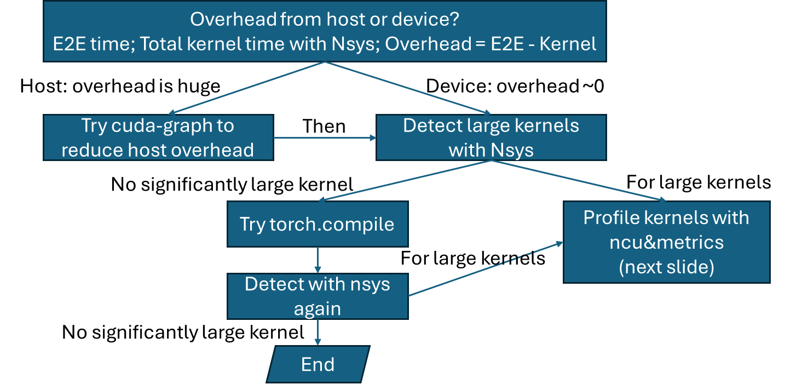

# Improving Execution Performance

nnScaler relies on highly efficient computational operators, typically implemented as GPU programs, to achieve optimal performance. To help you get the most out of your implementation, we’ve compiled a set of best practices and optimization strategies. These include techniques for identifying and addressing performance bottlenecks. The following sections provide actionable guidance and examples to support your optimization efforts.

## How to tune end-to-end execution performance?

## How to tune kernel performance?
### Key Metrics

- **Compute**: `tflops%`
- **L1/smem**: `bw%`
- **L2**: L2 hit rate, `L2 bw%`
- **DRAM**: `dram bw%`
- **Occupancy**
- **Smem bank conflict**; local load

---

### Identify Bottleneck

- **Compute bound**: bottlenecked by compute `tflops`, _good!_
- **Memory bound**: bottlenecked by a memory layer  
  - Calculate the theoretical memory throughput to identify the optimization space  
  - DRAM, L2, smem optimizations (in next slide)
- **Occupancy**: small grid/block, both compute and memory utils are low  
  - Check grid/block size/active warps  
  - Check wavefront
- **Latency bound**: few threads to overlap instruction latency, both compute and memory utils are low  
  - Pipeline/warp specialization

## Key optimizations

### Memory Bound

- **Align memory transaction**: coalesced memory access, vectorization (`float4`)
- **Resolve shared memory (smem) bank conflict**: padding, swizzle, replication
- **Improve L2 hit rate**: L2 rasterization (threadblock swizzle)
- **"Local load > 0" → register spill**: reduce register tile
- **Adjust tile size**

### Latency Bound

- **Reduce compute/memory I/O bubble**: pipeline overlapping

### Occupancy

- **Wavefront alignment**
- **Split-K** to increase parallel tasks

## How to debug kernel correctness?

### Launch Failure

- **nvcc flag**: e.g., `-code=sm_80`
- **Resource overflow**: https://docs.nvidia.com/cuda/cuda-c-programming-guide/#features-and-technical-specifications-technical-specifications-per-compute-capability
- **Seg fault / illegal memory access**: check shape, check addresses
- **Async barrier**: output is incorrect and inconsistent
- **Memory fence**: async copy + sync copy, different threads

---

### Precision

- **FP32 accum**

---

### Wrong Result

- Take a block or thread and print results (use `printf`)
